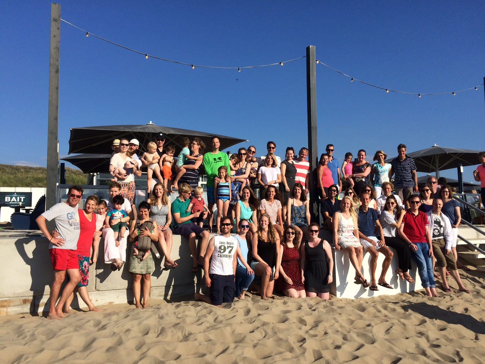

# Hello Readers

This is a first start of a lab manual for the Brain and Development Research Center [(website)](http:www.brainanddevelopment.nl). The aim is to gather a lot of information how we work or how we *want to work* in one place in a searchable format. The easiest way is to open the html version of this document in a browser (note: this could be online but we can keep it local if preferred).  

Currently, a lot of useful information about setting up projects, data management, etc is scattered around the J-disk in Leiden. We aim to bring all this information together in this lab manual and while using it add other things that might be useful and important.  

We use R Bookdown [(website)](https://bookdown.org/), an extension of R Markdown, to make this manual. It is a great tool: we can write text, include code chunks and figures. Also photos:

```{r pressure, echo=FALSE, out.width = '100%',fig.align='center'}

```


Eduard Klapwijk, Leiden 5 February 2020


